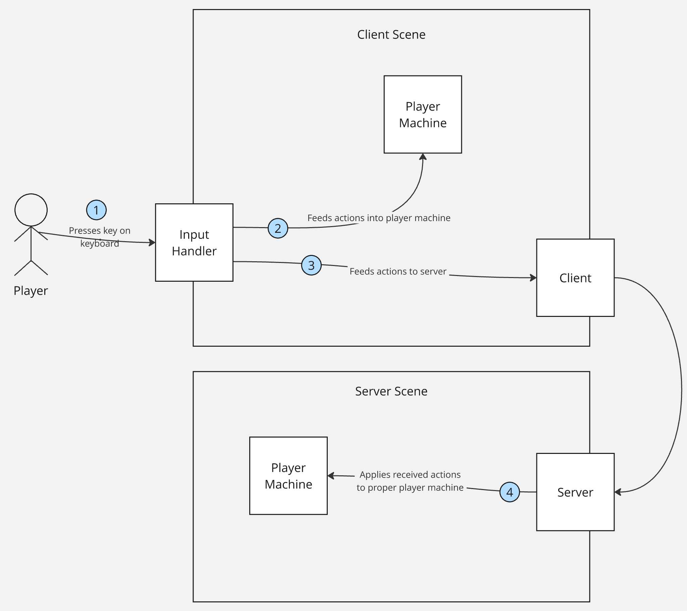
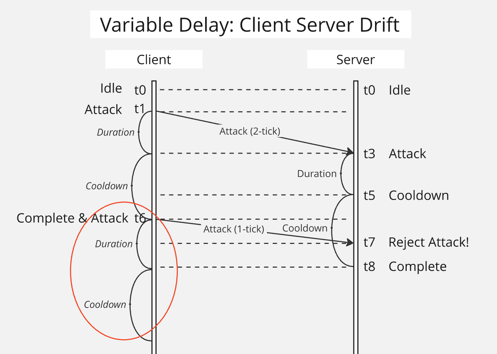
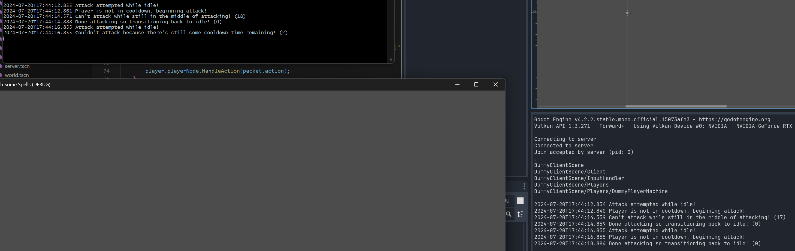

# Godot Desync Example

## Description

This repository provides a dummy LiteNetLib client and server implementation

The server is not yet authoritative, so desyncs in the simulation are permanent

## Development

First, build the repo:
- `dotnet build`

Then, run the server:
- `<your-godot-mono-binary> scenes/dummy_server_scene.tscn --headless`

Keep the server running, and then run the client:
- `<your-godot-mono-binary> scenes/dummy_client_scene.tscn`

You could also just play the client scene alone in Godot

Use the left mouse button in the client screen, and you'll send actions to the server

## Layout

This is a high level view of the layout for this project

## Problem

## Resources

This problem is described somewhat in detail here, but the solutions are hand waved: https://www.gabrielgambetta.com/client-side-prediction-server-reconciliation.html

The problem seems to be different when it involves actions, it's similar to the problem outlined here: https://gamedev.stackexchange.com/questions/116500/synchronizing-client-server-actions (the solutions proposed in this are pretty awful, essentially saying you should make your game lockstep)
